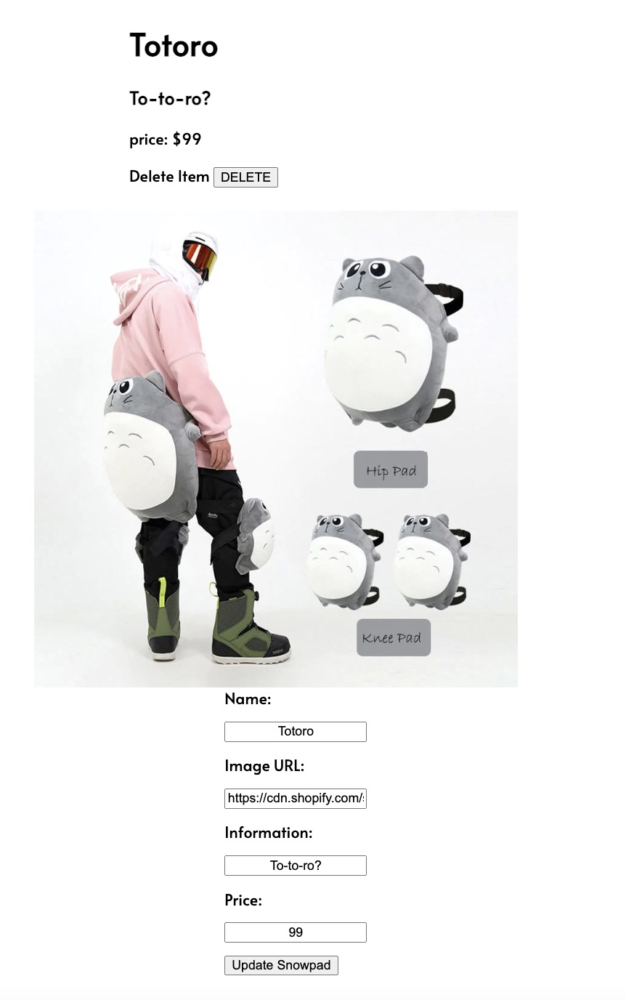

# Snow-Pad

### Team Members:
#### 1. Release Manager - Winston
#### 2. Product Manager - Ella
#### 3. Lead Frontend Dev - Sonam
#### 4. Lead Backend Dev - Cody

---

### Project Description: Snow Pad is a full CRUD-MERN ecommerce single page application. 

---

### User Stories 

### ADMIN
#### 1. As an admin user building an ecommerce website, I need to make products visible so the customer can view products.
#### 2. As an admin user, I need to see an “add to cart” button so customers can purchase the product(s).
#### 3. As an admin user, I want to build authentication to ensure customers can view previous orders and account details.
#### 4. As an admin user, I need to update and edit products to ensure our inventory is accurate.
#### 5. As an admin user, I need to delete products to ensure our inventory is accurate.

### CUSTOMER
#### 1. As a customer, I want to have the ability to register for an account and be informed if I have an existing account or if there are any errors so that I can fix them.
#### 2. As a customer, I need to be able to submit my payment details and get authorization to complete my order during checkout.

---

### Wireframes 
#### ()
#### ()
#### ()

---

### ERD Diagram 
#### ()

---

### Screen Shots - In Progress
#### 
#### 
#### 

---

### Technologies Used:
#### 1. Mongoose
#### 2. API Key
#### 3. NPM
#### 4. VS. CODE
#### 5. JIRA

---

### Getting Started: 
#### 
#### JIRA BOARD: https://bookmark-4.atlassian.net/jira/software/projects/PTMSA/boards/3

---

#### Netlify Link: In Progress

---

### Future Enhancements: 
#### 1. Add Search Bar
#### 2. Expand dataset to include more products
#### 3. Seamless checkout process with minimal steps
#### 4. Authentication
#### 5. Add dark/light mode 